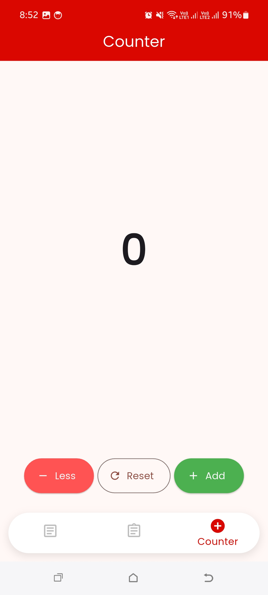

# Physiomobile - Developer Test

**Physiomobile - Developer Test** is a Flutter-based mobile app created for developer testing purposes. This app demonstrates several features, including fetching data from an API, form validation, a counter app with state management, and caching data for offline usage. It also showcases good practices in state management using the **Provider** package, alongside local storage with **Hive**.

## Features

- **Splash Screen**: A welcoming screen with a smooth animation and a clear transition to the app's main content.
- **Posts List**: Fetches and displays a list of posts from an API (https://jsonplaceholder.typicode.com/posts) and shows them in a neat and responsive ListView.
- **Form with Validation**: A simple form with input validation for a user’s name and email address, complete with error messages and the ability to reset the form.
- **Counter App**: Implements a counter with state management, supporting both increment and decrement operations while ensuring the counter doesn't go below zero.
- **Offline Caching**: Posts data is cached locally using **Hive**, allowing the app to display previously fetched data when offline.

## Screenshots

## Packages Used :

- **Provider**: State management across the app, particularly for managing the state of posts and the form.
- **Google Fonts**: Used to add custom fonts from Google Fonts for better typography.
- **HTTP**: For making HTTP requests to fetch posts data from an API.
- **Hive & Hive Flutter**: For local storage of posts, enabling offline caching functionality.
- **Connectivity Plus**: Checks the network connection status to determine if the device is online or offline.
- **Path Provider**: For accessing the file system to store cached data locally.

## License :

This project is licensed under the MIT License.
